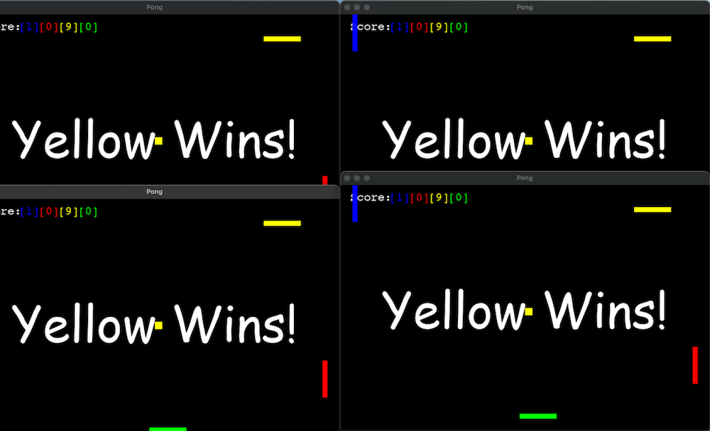

# pong_game
Multiplayer (4 player over network) ping pong game

## Clone

    git clone https://github.com/vkmrishad/pong_game.git
    or
    git clone git@github.com:vkmrishad/pong_game.git

## Environment and Package Management
Install Poetry

    $ pip install poetry
    or
    $ pip3 install poetry

Activate or Create Env

    $ poetry shell

Install Packages from Poetry

    $ poetry install

NB: When using virtualenv, install from `$ pip install -r requirements.txt`.

## Runserver
First need to run `server.py`

    $ python3 server.py

After that run app in 4 terminals (Should run 4 games to start)

    $ python3 run.py

For non network based game run

    $ python3 game.py

## Keyboard shortcut
- Player1(Blue)
  - W (Up)
  - S (Down)
- Player2(Red)
  - Up Arrow (Up)
  - Down Arrow (Down)
- Player3(Yellow)
  - A (Left)
  - D (Right)
- Player4(Green)
  - Left Arrow (Left)
  - Right Arrow (Right)
